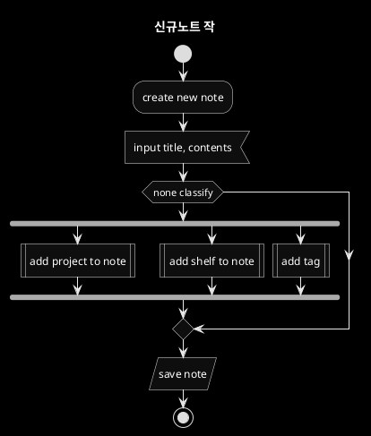
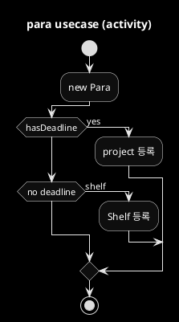
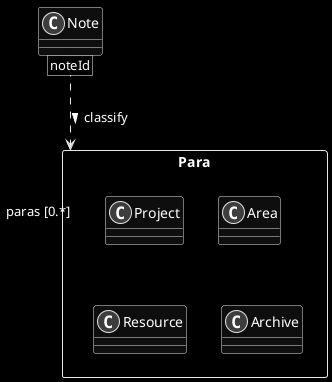
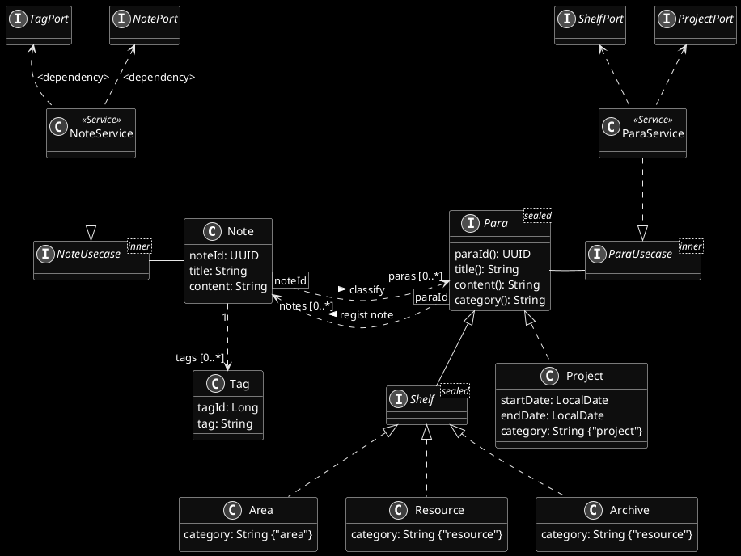
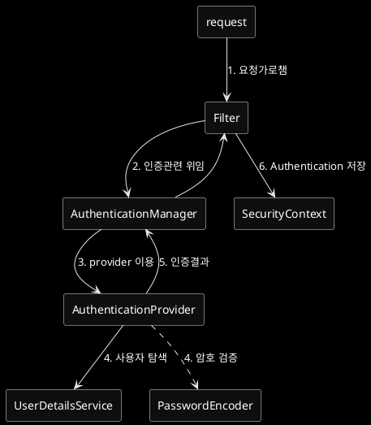
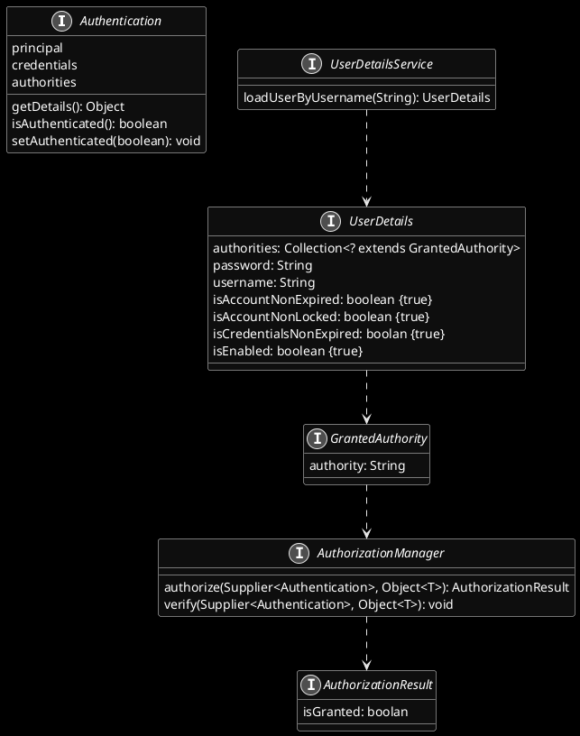

# PARA 분류법

PARA 분류법에 대한 백엔드 구현체입니다.

## 디지털노트 분류 흐름도




## 디지털노트 상태표

 ```plantuml
 @startuml
 skinparam monochrome reverse
 
 title PARA 분류하기(state)
 
 state Inbox : 분류할 노트
 
 [*] --> Inbox : note
 
 state PARA {
 state hasDeadline <<entryPoint>>
 state isJob <<entryPoint>>
 state withInterest <<entryPoint>>
 state Project : 기한 내 완성해야 할 노트 목록
 state Area : 메인 업무. 회사업무 등
 state Resource : 관심있는 주제들. 취미활동 등
 state Archive : 보관할 Project, Area, Resource
 
 hasDeadline --> Project : 프로젝트로 분류
 Project --> [*] : 폐기
 
 isJob --> Area : Area로 분류
 Area --> Resource : 관심사 변경
 Area --> Archive : 보관
 
 withInterest --> Resource : Resource로 분류
 Resource --> Area : 관심사 변경
 Resource --> Archive : 보관
 Archive --> Area : 활성화
 Archive --> Resource : 활성화
 Archive --> [*] : 폐기
 }
 
 Inbox --> hasDeadline
 Inbox --> isJob
 Inbox --> withInterest
 
 PARA --> [*] : Note 삭제
 
 @enduml
 ```

## Deadline 이 있는 Project



## PARA 논리 모델



## PARA 구현 모델
- 분류방법을 카테고리화 하는 것이 좋겠다고 판단
- Data Object Programming(DOP) 방식으로 모델을 구성
- java의 record를 활용
- category 필드는 infra/api 구현시 도출 되었음



## Spring Security 프로세스  



## Spring Security 도에인 language




